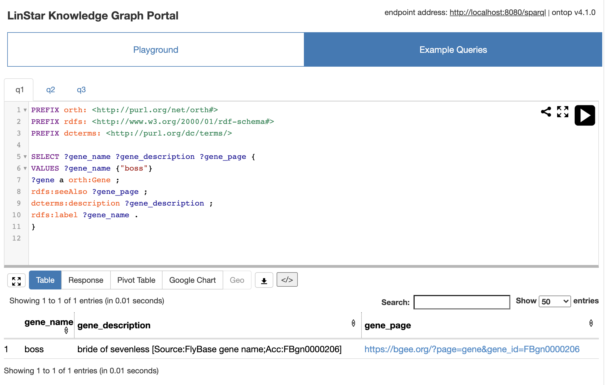

# An Ontop tutorial using the Bgee database

**Copyrights**
- Data (under the [data](data) directory): [CC0](https://creativecommons.org/share-your-work/public-domain/cc0/)
- Text: [CC-BY 4.0](https://creativecommons.org/licenses/by/4.0/legalcode)
- Code: [Apache 2.0](https://www.apache.org/licenses/LICENSE-2.0)

**Table of Contents**

- [Repository structure](#repository-structure)
- [Setting up the PostgreSQL database](#setting-up-the-postgresql-database)
- [Setting up the VKG using Ontop-Protégé](#setting-up-the-VKG-using-ontop-protégé)  
- [Deploy a SPARQL endpoint using Ontop CLI](#deploy-a-sparql-endpoint-using-ontop-cli)
- [Deploy a SPARQL endpoint using Ontop Docker](#deploy-a-sparql-endpoint-using-pntop-docker)

## Repository structure

~~~
.
├── data
│   ├── mysql.zip
│   └── postgresql.zip
├── LICENSE
├── obda
│   ├── bgee_v14_genex.obda
│   ├── bgee_v14_genex.owl
│   ├── bgee_v14_genex.properties
│   ├── bgee_v14_genex.q
│   └── bgee_v14_genex.r2rml
└── README.md
~~~

- `data`: MySQL and postgres dumps
- `bgee_v14_genex.obda`: Mapping file (Ontop syntax)
- `bgee_v14_genex.r2rml`: Mapping file (R2RML syntax)
- `bgee_v14_genex.owl`: Ontology file
- `bgee_v14_genex.properties`: Properties file
- `bgee_v14_genex.q`: Queries file for Protege

### Setting up the PostgreSQL database

1) Create a database called `easybgee_v14_2`. For example, in `pgsql` you can use the command:

~~~shell
pgsql> CREATE DATABASE easybgee_v14_2;
~~~

2) Unzip the postgres archive to extract the dump file.

3) Use the extracted dump file to create a database `easybgee_v14_2`. For example, you can use the following bash `pgsql` invocation:

~~~
$> PGPASSWORD=$pwd psql -h $host -p $port --user=$user --dbname=easybgee_v14_2 -f $dump_file
~~~

4) Provide the connection parameters to your database in the [bgee_v14_genex.properties](obda/bgee_v14_genex.properties) file. Replace the placeholders `<host>`,`<port>`, `<user>`, and `<password>` with appropriate values.

~~~properties
jdbc.url=jdbc\:postgresql\://<host>\:<port>/easybgee_v14_2
jdbc.driver=org.postgresql.Driver
jdbc.user=<user>
jdbc.password=<password>
~~~

### Setting up the VKG using Ontop-Protégé

1) Download the latest version of Ontop+Protégé [bundle](https://sourceforge.net/projects/ontop4obda/files/). For this tutorial, we will use the Ontop 4.1.0 bundle for Linux systems. Choose a bundle suitable to your operating system.

2) Unzip the bundle. Launch Protégé through the dedicated script. In case of linux, the command is

~~~
$> ./run.sh
~~~

3) Click on the `File` Menu, then `Preferences` and then to the `JDBC Drivers` tab to add the downloaded jdbc driver to Protégé:


4) Click on the `File` Menu, then `Open` to open the Bgee ontology (`bgee_v14_genex.owl` file).


5) Check whether the connection to the database is working property, by clicking the `Test Connection` button under the `Datasource Manager` sub-tab of the `Ontop Mappings` tab.

 

6) Browse the ontology and mapping in the `Ontop Mappings` / `Mapping Manager` tab.

7) Click on the `Reasoner` Menu, then select `Ontop 4.1.0`

8) Click again on the `Reasoner` Menu, and on `Start Reasoner` to start Ontop

### SPARQL Query answering in Ontop-Protégé  


1) At this point, you are ready to try Ontop to answer the Bgee queries. To do so, use the `Ontop SPARQL` tab.


#### How Ontop Answers your Queries

Ontop operates in _virtual mode_, that is, the KG extracted from the mappings is not materialized. The SPARQL queries are translated on-the-fly into corresponding SQL queries executable over the original data source, by exploiting the mapping definitions and the ontology axioms. To see what is the SQL translation corresponding to your SPARQL query, you can right-click on the `SPARQL query editor` field and select the `View SQL translation` option:


### Materialize RDF Triples in Ontop-Protégé

If you do not want to use Ontop for SPARQL query answering, you have the option to materialize the KG and import it into your favorite triple store. To do this, click on the `Ontop` Menu and then `Materialize triples...` option.


## Deploy a SPARQL endpoint using Ontop CLI

1) Download Ontop [CLI](https://sourceforge.net/projects/ontop4obda/files/). For this tutorial, we will use the Ontop 4.1.0 CLI bundle. Exact the zip file of Ontop CLI to a directory, which is denoted as $ONTOP_CLI_DIR below.
   
2) Copy the [jdbc driver](jdbc/postgresql-42.2.14.jre7.jar) to the `$ONTOP_CLI_DIR/jdbc`

3) Go to the `obda` directory and start the Ontop SPARQL Endpoint

`$ONTOP_CLI_DIR/ontop endpoint --ontology=bgee_v14_genex.owl --mapping=bgee_v14_genex.obda --properties=bgee_v14_genex.properties --portal=bgee_v14_genex.toml`

4) Navigate to <http://localhost:8080> to try the Web portal of the SPARQL endpoint



5) A SPARQL endpoint backed by ontop at URL <http://localhost:8880/sparql> (assuming default port `8880` is used), which may be accessed using any HTTP client, including SPARQL clients and tools using the standard SPARQL HTTP protocol. For instance, using curl:

```shell
curl --request POST \
   --url http://localhost:8880/sparql \
   --header 'accept: application/json' \
   --header 'content-type: application/sparql-query' \
   --data 'SELECT * { ?s ?p ?o } LIMIT 5'
```

## Deploy a SPARQL endpoint using Ontop Docker

### Requirements
* [Docker](https://docs.docker.com/get-docker/), version 17.09.0 or higher
* [Docker Compose](https://docs.docker.com/compose/install/), version 1.17.0 or higher

### Steps

1) to start the prototype, downloading / building the required images and containers if needed
  ```
  docker-compose up
  ```
  (note: may add option `-d` to run in background, in which case logs are not be displayed to standard output but are still accessible via `docker-compose logs`)

**Services** When running, the prototype exposes the following services:

* a PostgreSQL server with the sample data, with connection information defined in the [.env](`.env`) file. 

* a Web portal of the SPARQL endpoint backed by ontop at URL <http://localhost:8880/>
  
* a SPARQL endpoint backed by ontop at URL <http://localhost:8880/sparql> (assuming default port `8880` is used).

2) to stop the prototype, if running
  ```
  docker-compose down
  ```

3) to stop the prototype, if running, and also clean any image / container / data associating to it (useful for cleaning up)
  ```
  docker-compose down --volumes --remove-orphans
  ```
  (note: the above command does not remove Docker images that may result being unused after stopping and removing this prototype containers; to remove such images, add option `--rmi all`)

4) to check the status of the containers forming the prototype
  ```
  docker-compose ps
  ```

5) to check the logs of specific container(s) or of all containers (if no container name is supplied)
  ```
  docker-compose logs <container name 1> ... <contaner name N>
  ```

