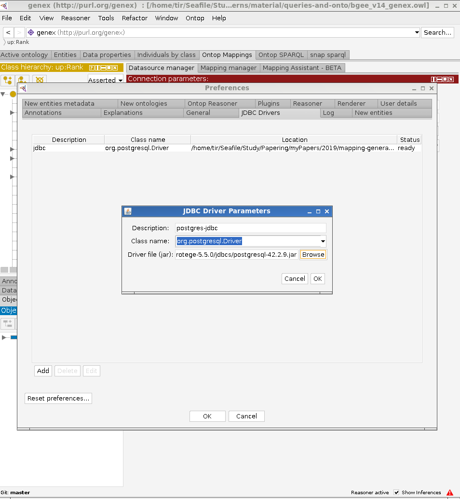
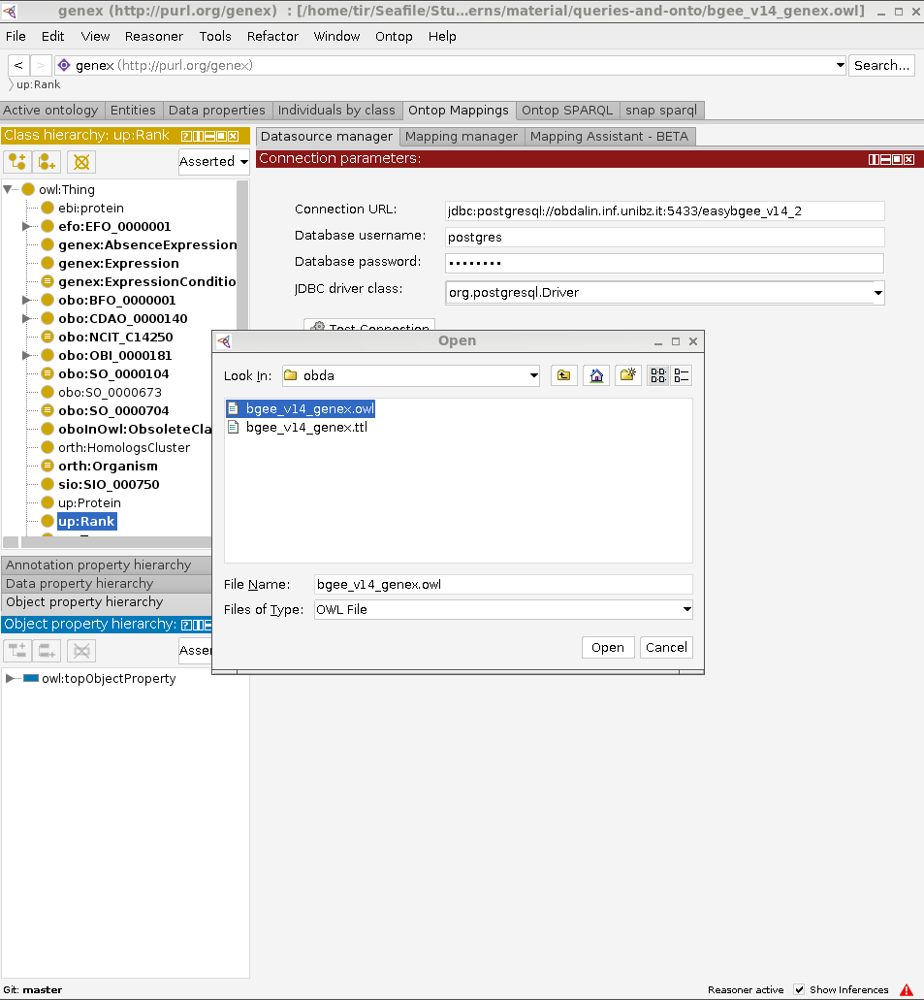
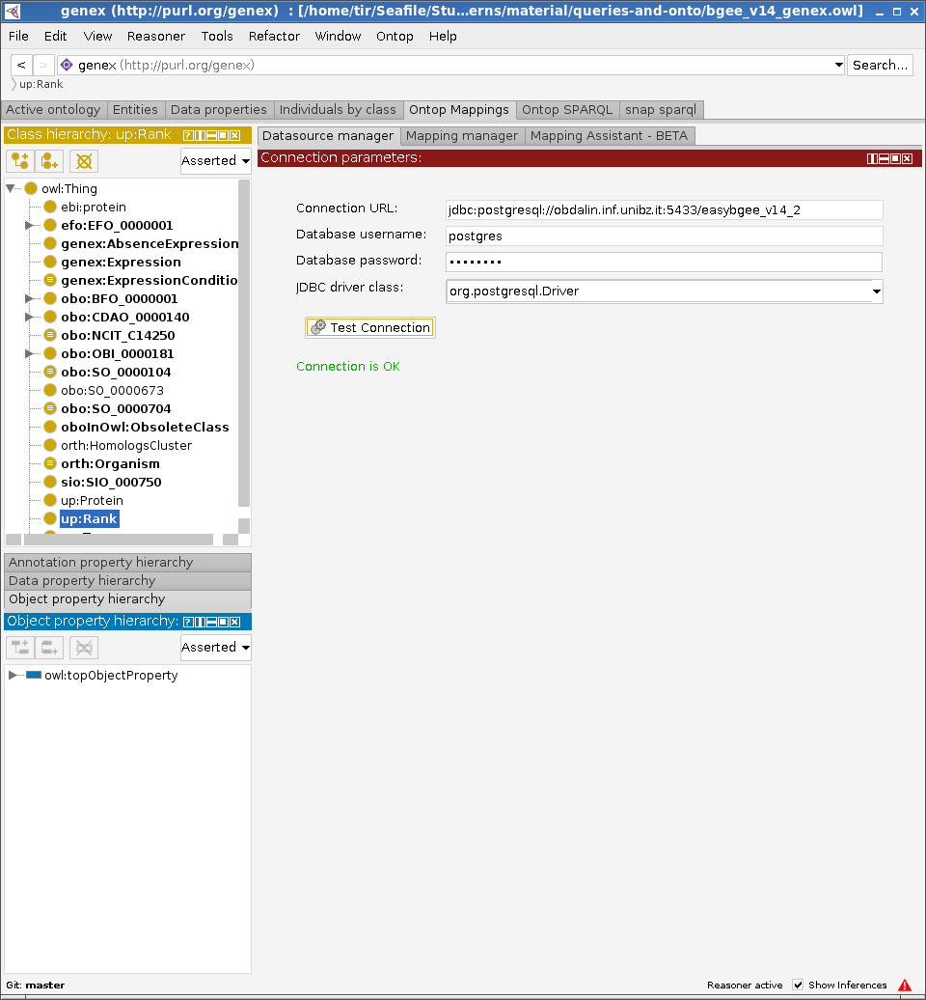
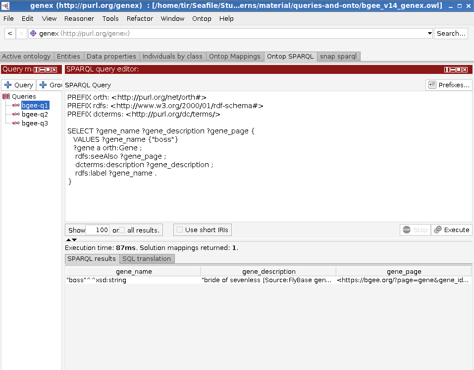
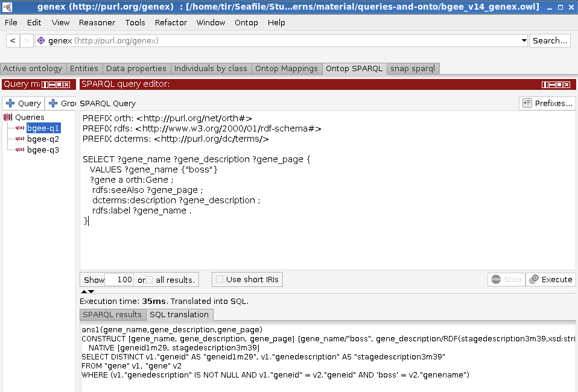
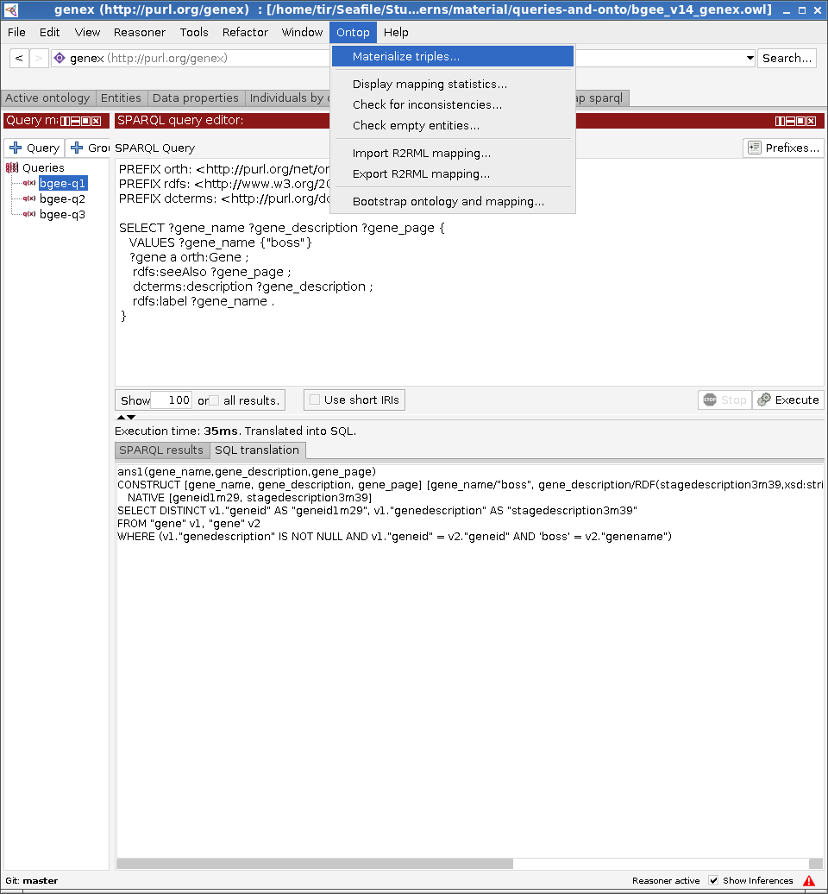

# patterns-tutorial
patterns-tutorial

Data: CC 0
Text: CC 4.0-BY

## Content

~~~
.
├── data
│   ├── mysql.zip
│   └── postgresql.zip
├── LICENSE
├── obda
│   ├── bgee_v14_genex.obda
│   ├── bgee_v14_genex.owl
│   ├── bgee_v14_genex.properties
│   ├── bgee_v14_genex.q
│   └── bgee_v14_genex.r2rml
└── README.md
~~~

- `data`: MySQL and postgres dumps
- `bgee_v14_genex.obda`: Mapping file (Ontop syntax)
- `bgee_v14_genex.r2rml`: Mapping file (R2RML syntax)
- `bgee_v14_genex.owl`: Ontology file
- `bgee_v14_genex.properties`: Properties file
- `bgee_v14_genex.q`: Queries file for Protege

## Protégé+postgres Tutorial

In this tutorial we will use the postgres dump and the graphical tool Protégé. 

### Setting up the PostgreSQL database with the sample data

1) Create a database called `easybgee_v14_2`. For example, in `pgsql` you can use the command:

~~~shell
pgsql> CREATE DATABASE easybgee_v14_2;
~~~

2) Unzip the postgres archive to extract the dump file.

3) Use the extracted dump file to create a database `easybgee_v14_2`. For example, you can use the following bash `pgsql` invocation:

~~~
$> PGPASSWORD=$pwd psql -h $host -p $port --user=$user --dbname=$db_name -f $dump_file
~~~

4) Provide the connection parameters to your database in the [bgee_v14_genex.properties](obda/bgee_v14_genex.properties) file. Replace the placeholders `<host>`,`<port>`, `<user>`, and `<password>` with appropriate values.

~~~properties
jdbc.url=jdbc\:postgresql\://<host>\:<port>/easybgee_v14_2
jdbc.driver=org.postgresql.Driver
jdbc.user=<user>
jdbc.password=<password>
~~~

### Setting up the VKG using Ontop-Protégé

1) Download the latest version of Ontop+Protégé [bundle](https://sourceforge.net/projects/ontop4obda/files/). For this tutorial, we will use the Ontop 4.1.0 bundle for Linux systems. Choose a bundle suitable to your operating system.

2) Unzip the bundle. Launch Protégé through the dedicated script. In case of linux, the command is

~~~
$> ./run.sh
~~~

3) Click on the `File` Menu, then `Preferences` and then to the `JDBC Drivers` tab to add the downloaded jdbc driver to Protégé:

4) Click on the `File` Menu, then `Open` to open the Bgee ontology (`bgee_v14_genex.owl` file).

5) Check whether the connection to the database is working property, by clicking the `Test Connection` button under the `Datasource Manager` sub-tab of the `Ontop Mappings` tab.

 

6) Browse the ontology and mapping in the `Ontop Mappings` / `Mapping Manager` tab.

7) Click on the `Reasoner` Menu, then select `Ontop 4.1.0`

8) Click again on the `Reasoner` Menu, and on `Start Reasoner` to start Ontop

### SPARQL Query answering in Ontop-Protégé  

1) At this point, you are ready to try Ontop to answer the Bgee queries. To do so, use the `Ontop SPARQL` tab.

#### How Ontop Answers your Queries

Ontop operates in _virtual mode_, that is, the KG extracted from the mappings is not materialized. The SPARQL queries are translated on-the-fly into corresponding SQL queries executable over the original data source, by exploiting the mapping definitions and the ontology axioms. To see what is the SQL translation corresponding to your SPARQL query, you can right-click on the `SPARQL query editor` field and select the `View SQL translation` option:

### Materialize RDF Triples in Ontop-Protégé

If you do not want to use Ontop for SPARQL query answering, you have the option to materialize the KG and import it into your favorite triple store. To do this, click on the `Ontop` Menu and then `Materialize triples...` option.

### 